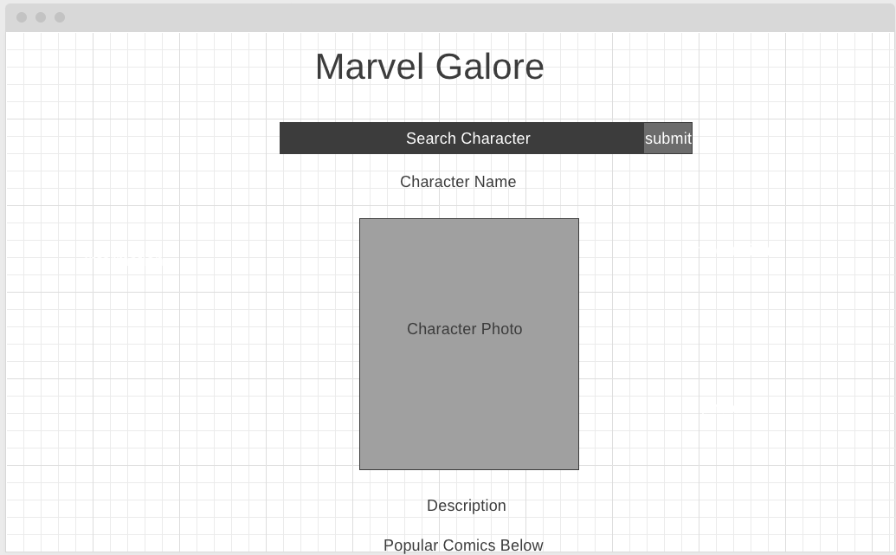
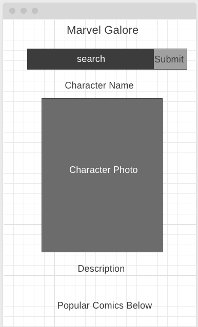

## Project Name

[Marvel Galore](https://jeshaiahmiller.github.io/Marvel-Galore/)

## Project Description

This is a site that allows you to search your favorite marvel characters. This will display information about them.

## API and Data Sample

I am using the marvel.com api. Here's the link: https://developer.marvel.com/

```
{
    "code": 200,
    "status": "Ok",
    "copyright": "© 2021 MARVEL",
    "attributionText": "Data provided by Marvel. © 2021 MARVEL",
    "attributionHTML": "<a href=\"http://marvel.com\">Data provided by Marvel. © 2021 MARVEL</a>",
    "etag": "7534d3b6fd5ea48503c2a8a3d079004bae1fa800",
    "data": {
        "offset": 0,
        "limit": 20,
        "total": 50199,
        "count": 20,
        "results": [
            {
                "id": 82967,
                "digitalId": 0,
                "title": "Marvel Previews (2017)",
               
```

## Wireframes




### MVP/PostMVP


#### MVP 
<!-- *These are examples only. Replace with your own MVP features.* -->
- Use marvel api to receive relevant information.
- Add javascript to create functionality
- Render popular Marvel comics onto the page onto the page.
- Allows the user to search Marvel characters.
- Shows user information about the character they searched.
- Style the page using flex box and css
- Add media queries to cater to different screen sizes.


#### PostMVP  
<!-- *These are examples only. Replace with your own Post-MVP features.* -->
- Add information about creators
- Add additional styling

## Project Schedule

<!-- This schedule will be used to keep track of your progress throughout the week and align with our expectations.  

You are **responsible** for scheduling time with your squad to seek approval for each deliverable by the end of the corresponding day, excluding `Saturday` and `Sunday`. -->
|  Day | Deliverable | Status
|---|---| ---|
|nov 7| Wireframes / Priority Matrix / Timeframes | complete
|nov 8| Core Application Structure (HTML, CSS, etc.) | complete
|nov 9| Pseudocode / actual code | complete
|nov 10| Initial Clickable Model  | complete
|nov 11-12| MVP | complete


## Priority Matrix

<!-- Include a full list of features that have been prioritized based on the `Time and Importance` Matrix.  Link this image in a similar manner to your wireframes -->


## Timeframes
<!-- Tell us how long you anticipate spending on each area of development. Be sure to consider how many hours a day you plan to be coding and how many days you have available until presentation day. -->


| Component | Priority | Estimated Time | Time Invested | Actual Time |
| --- | :---: |  :---: | :---: | :---: |
| Planning | H | 2hrs| 3.5hrs | 3.5hrs |
| HTML | H | 2hrs| 2.5hrs | 2.5hrs |
| pseudocoding | M | 3hrs| 2hrs| 2hrs|
| CSS | L | 3hrs | 3hrs | 4hrs|
| Js functionality | H | 4hrs | 4hrs | 4hrs |
| Events for buttons | H | 3hrs | 3hrs | 3hrs
| API calling | H | 4hrs | 4hrs | 4hrs |
| Retrieving data | H | 3hrs | 4hrs | 4hrs|
| Styling api | H | 4hrs | 2hrs | 2hrs |
| Responsive design | H | 4hrs | 2hrs | 2hrs
| Styling info/images | M | 3hrs | 3hrs | 3hrs
| Media queries | M | 4hrs | 4hrs | 4hrs |
| Testing functionality | M | 2hrs | 4hrs | 4hrs |
| Total | H | 41hrs| 39hrs | 39hrs |

## Code Snippet

<!-- Use this section to include a brief code snippet of functionality that you are proud of and a brief description.   -->
```
  let characterDescription = document.createElement('p')
    if (character.description === "") {
      characterDescription.innerText = "No description available"
      dataBoxes.appendChild(characterDescription)
    } else {
      characterDescription.innerText = character.description
      dataBoxes.appendChild(characterDescription)
    }
```

## Change Log
 I had to change the search options, because the api that I am using is only giving me a certain amount of data. There was no way to raise the limit of my data to over 100.